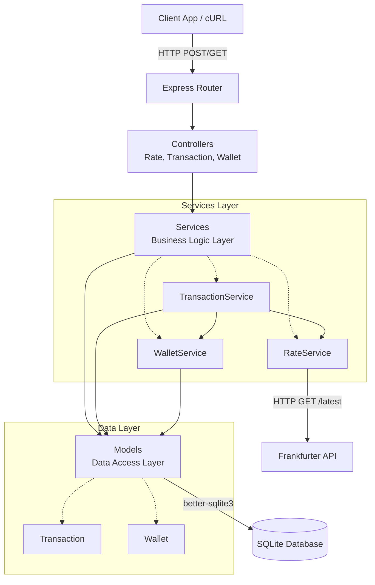
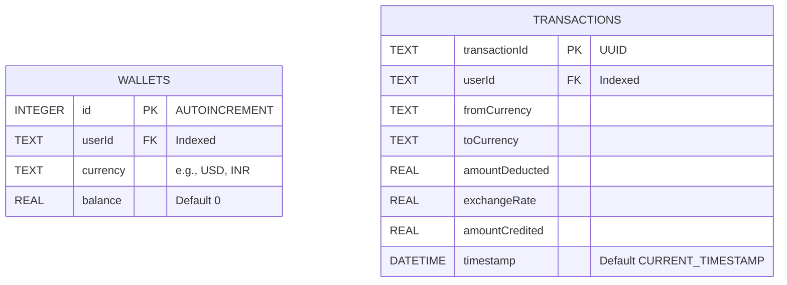
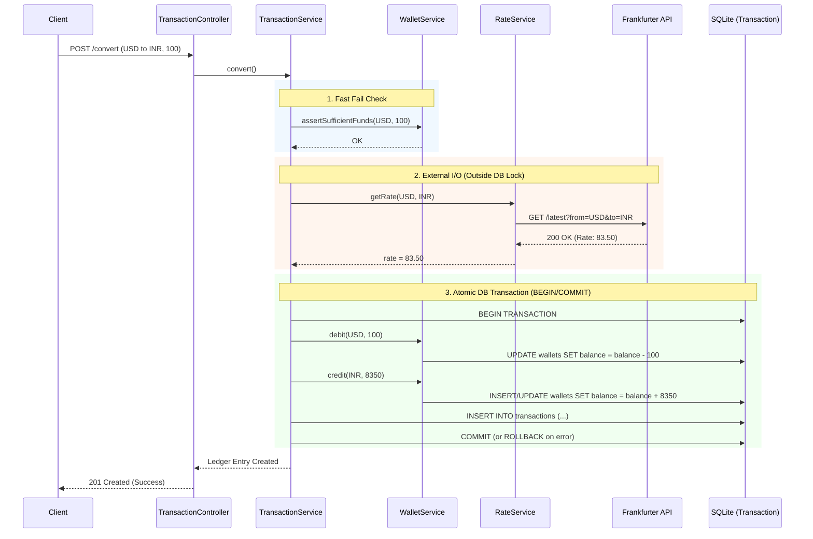

# FX-Lite: Real-time Currency Exchange & Ledger API

A lightweight, production-ready backend microservice for cross-border currency conversions. Built with **Node.js**, **Express.js**, **SQLite** (`better-sqlite3`), and integrated with the free [Frankfurter API](https://api.frankfurter.app) for live exchange rates.

---

## Directory Structure

```
FX_LITE/
├── scripts/
│   └── initDb.js           # DB schema bootstrap + demo user seed
├── src/
│   ├── app.js              # Express app factory (testable, port-agnostic)
│   ├── config/
│   │   └── db.js           # SQLite singleton connection + schema init
│   ├── controllers/
│   │   ├── RateController.js
│   │   ├── TransactionController.js
│   │   └── WalletController.js
│   ├── middlewares/
│   │   └── errorHandler.js # Centralized 404 + error handler
│   ├── models/
│   │   ├── Transaction.js  # Ledger table ORM
│   │   └── Wallet.js       # Wallets table ORM
│   ├── routes/
│   │   ├── index.js        # Route barrel (mounts all sub-routers)
│   │   ├── rateRoutes.js
│   │   ├── transactionRoutes.js
│   │   └── walletRoutes.js
│   ├── services/
│   │   ├── RateService.js        # Frankfurter API integration
│   │   ├── TransactionService.js # Conversion orchestrator (atomic)
│   │   └── WalletService.js      # Balance rules & fund checks
│   └── utils/
│       ├── ApiError.js     # Typed, operational error class
│       └── asyncHandler.js # Async route wrapper (no try/catch boilerplate)
├── data/                   # SQLite .db file lives here (gitignored)
├── .dockerignore
├── .env.example
├── .gitignore
├── Dockerfile
├── package.json
└── server.js               # Entry point — seeds schema, starts HTTP server
```

---

## System Architecture



---

## Quick Start (Local)

```bash
# 1. Install dependencies
npm install

# 2. Seed the database with demo user "101" (1000 USD + 50000 INR)
npm run init-db

# 3. Start the server (auto-restarts on file change in dev)
npm run dev
# or for production:
npm start
```

The server starts on **http://localhost:3000**.

---

## API Endpoints

### `GET /health`
Simple health/liveness probe.
```json
{ "success": true, "status": "ok", "timestamp": "..." }
```

---

### `GET /api/wallet/:userId`
Returns all currency balances for a user.

**Example:**
```bash
curl http://localhost:3000/api/wallet/101
```
```json
{
  "success": true,
  "data": {
    "userId": "101",
    "wallets": [
      { "currency": "INR", "balance": 50000 },
      { "currency": "USD", "balance": 1000 }
    ]
  }
}
```

---

### `GET /api/rates?base=USD&target=INR`
Fetches the live conversion rate from the Frankfurter API.

**Example:**
```bash
curl "http://localhost:3000/api/rates?base=USD&target=INR"
```
```json
{
  "success": true,
  "data": { "base": "USD", "target": "INR", "rate": 95.44, "date": "2026-08-11" }
}
```

---

### `POST /api/transaction/convert`
Executes an atomic cross-currency swap.

**Payload:**
```json
{ "userId": "101", "fromCurrency": "USD", "toCurrency": "INR", "amount": 100 }
```

**Example:**
```bash
curl -X POST http://localhost:3000/api/transaction/convert \
  -H "Content-Type: application/json" \
  -d '{"userId":"101","fromCurrency":"USD","toCurrency":"INR","amount":100}'
```
```json
{
  "success": true,
  "data": {
    "transactionId": "71d60833-908a-4ef6-8a39-9f3c296713aa",
    "userId": "101",
    "fromCurrency": "USD",
    "toCurrency": "INR",
    "amountDeducted": 100,
    "exchangeRate": 95.44,
    "amountCredited": 9544,
    "timestamp": "2026-08-11 18:40:00"
  }
}
```

**Insufficient Funds (400):**
```json
{
  "success": false,
  "error": {
    "message": "Insufficient Funds",
    "details": { "userId": "101", "currency": "USD", "requested": 999999, "available": 900 }
  }
}
```

---

### `GET /api/transaction/:userId`
Returns the 50 most recent ledger entries for a user (bonus endpoint).
```bash
curl http://localhost:3000/api/transaction/101
```

---

## Database Schema (ER Diagram)



---

## Transaction Logic (Requirement #5)

The `POST /api/transaction/convert` endpoint performs the following steps atomically:

1. **Sufficient-funds check** — Fast-fail before any external I/O.
2. **Fetch live rate** — Calls Frankfurter API outside the DB transaction (never hold a lock over a network call).
3. **Calculate credited amount** — `amountCredited = round(amount × rate, 2)`.
4. **Atomic DB transaction** — `better-sqlite3`'s `db.transaction()` wraps steps 4–5 in a native `BEGIN / COMMIT`, with automatic `ROLLBACK` on any exception:
   - Deduct from `fromCurrency` wallet.
   - Credit `toCurrency` wallet (auto-creates the wallet row if first time).
   - Insert immutable ledger row into `transactions` table.

### Execution Flow (Sequence Diagram)



---

## Docker

```bash
# Build the image
docker build -t fx-lite .

# Run with a named volume so the SQLite DB persists across container restarts
docker run -d \
  -p 3000:3000 \
  -v fx-lite-data:/usr/src/app/data \
  --name fx-lite \
  fx-lite
```

The `CMD` in the Dockerfile runs `node scripts/initDb.js` (idempotent) before `node server.js`, so the database is always seeded on first run.

---

## OOP Design Decisions

| Class | Layer | Responsibility |
|---|---|---|
| `Wallet` | Model | Raw SQL to `wallets` table; prepared statements as private static fields |
| `Transaction` | Model | Raw SQL to `transactions` table; immutable ledger inserts |
| `WalletService` | Service | Balance rules: `assertSufficientFunds`, `debit`, `credit` |
| `RateService` | Service | Frankfurter API integration; normalizes network errors into `ApiError` |
| `TransactionService` | Service | Orchestrates the full 5-step conversion workflow atomically |
| `WalletController` | Controller | HTTP ↔ WalletService translation only |
| `RateController` | Controller | HTTP ↔ RateService translation only |
| `TransactionController` | Controller | HTTP ↔ TransactionService translation only |
| `ApiError` | Utility | Typed operational errors with HTTP status codes |

**Key architectural choices:**
- **Singleton services** — stateless, one instance per process, injected into constructors for testability.
- **Factory `createApp()`** — separates app config from port binding, enabling `supertest` integration tests.
- **`asyncHandler` wrapper** — eliminates `try/catch` boilerplate from every async controller.
- **`db.transaction()` for atomicity** — native SQLite `BEGIN/COMMIT/ROLLBACK`, not application-level locking.

---

## Environment Variables

Copy `.env.example` to `.env` and set:

| Variable | Default | Description |
|---|---|---|
| `PORT` | `3000` | HTTP port |
| `DB_PATH` | `./data/fxlite.db` | SQLite file path |
| `FRANKFURTER_BASE_URL` | `https://api.frankfurter.app` | FX rate provider base URL |
