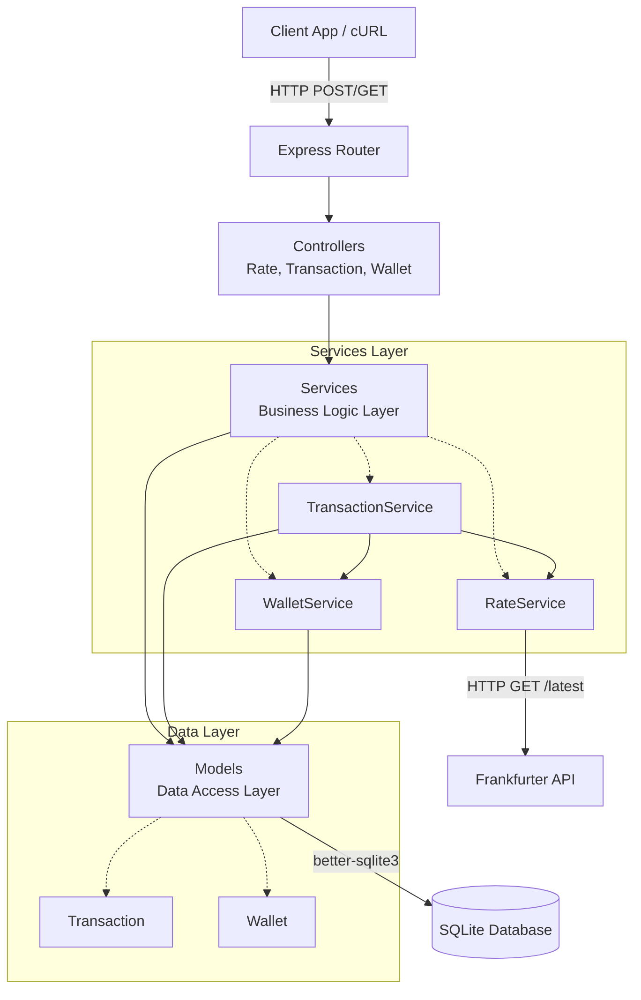
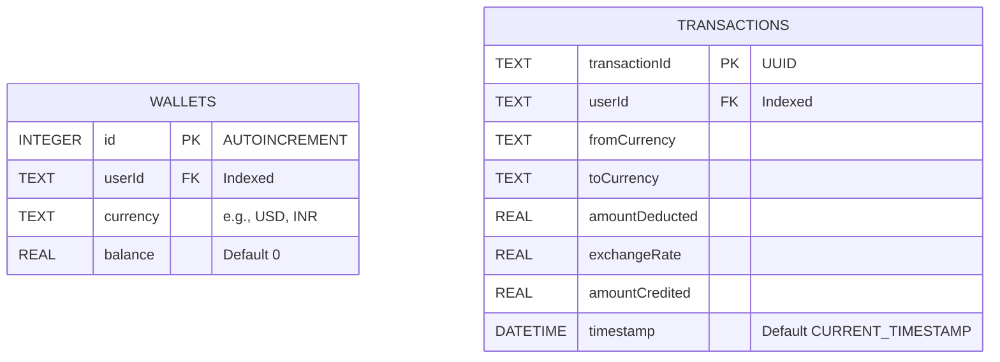
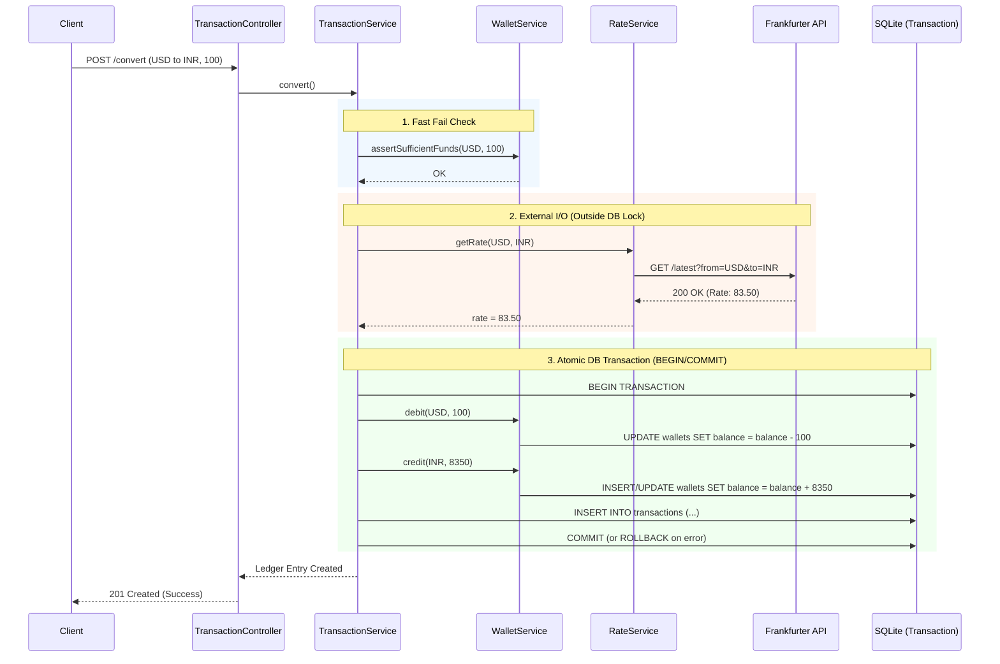

# FX-Lite + FX-Core: Real-time Currency Exchange & High-Performance Order Matching Engine

A production-ready backend microservice for cross-border currency conversions **plus** a bare-metal C++ order matching engine. Built with **Node.js**, **Express.js**, **SQLite** (`better-sqlite3`), and integrated with the free [Frankfurter API](https://api.frankfurter.app) for live exchange rates. The C++ engine (**FX-Core**) features manual memory management, custom heap data structures, OS-level threading, and sub-2µs average matching latency.

---

## Directory Structure

```
FX_LITE/
├── scripts/
│   └── initDb.js           # DB schema bootstrap + demo user seed
├── src/
│   ├── app.js              # Express app factory (testable, port-agnostic)
│   ├── config/
│   │   └── db.js           # SQLite singleton connection + schema init
│   ├── controllers/
│   │   ├── RateController.js
│   │   ├── TransactionController.js
│   │   └── WalletController.js
│   ├── middlewares/
│   │   └── errorHandler.js # Centralized 404 + error handler
│   ├── models/
│   │   ├── Transaction.js  # Ledger table ORM
│   │   └── Wallet.js       # Wallets table ORM
│   ├── routes/
│   │   ├── index.js        # Route barrel (mounts all sub-routers)
│   │   ├── rateRoutes.js
│   │   ├── transactionRoutes.js
│   │   └── walletRoutes.js
│   ├── services/
│   │   ├── RateService.js        # Frankfurter API integration
│   │   ├── TransactionService.js # Conversion orchestrator (atomic)
│   │   └── WalletService.js      # Balance rules & fund checks
│   └── utils/
│       ├── ApiError.js     # Typed, operational error class
│       └── asyncHandler.js # Async route wrapper (no try/catch boilerplate)
├── data/                   # SQLite .db file lives here (gitignored)
├── .dockerignore
├── .env.example
├── .gitignore
├── Dockerfile
├── package.json
└── server.js               # Entry point — seeds schema, starts HTTP server
```

---

## System Architecture



---

## Quick Start (Local)

```bash
# 1. Install dependencies
npm install

# 2. Seed the database with demo user "101" (1000 USD + 50000 INR)
npm run init-db

# 3. Start the server (auto-restarts on file change in dev)
npm run dev
# or for production:
npm start
```

The server starts on **http://localhost:3000**.

---

## API Endpoints

### `GET /health`
Simple health/liveness probe.
```json
{ "success": true, "status": "ok", "timestamp": "..." }
```

---

### `GET /api/wallet/:userId`
Returns all currency balances for a user.

**Example:**
```bash
curl http://localhost:3000/api/wallet/101
```
```json
{
  "success": true,
  "data": {
    "userId": "101",
    "wallets": [
      { "currency": "INR", "balance": 50000 },
      { "currency": "USD", "balance": 1000 }
    ]
  }
}
```

---

### `GET /api/rates?base=USD&target=INR`
Fetches the live conversion rate from the Frankfurter API.

**Example:**
```bash
curl "http://localhost:3000/api/rates?base=USD&target=INR"
```
```json
{
  "success": true,
  "data": { "base": "USD", "target": "INR", "rate": 95.44, "date": "2026-08-11" }
}
```

---

### `POST /api/transaction/convert`
Executes an atomic cross-currency swap.

**Payload:**
```json
{ "userId": "101", "fromCurrency": "USD", "toCurrency": "INR", "amount": 100 }
```

**Example:**
```bash
curl -X POST http://localhost:3000/api/transaction/convert \
  -H "Content-Type: application/json" \
  -d '{"userId":"101","fromCurrency":"USD","toCurrency":"INR","amount":100}'
```
```json
{
  "success": true,
  "data": {
    "transactionId": "71d60833-908a-4ef6-8a39-9f3c296713aa",
    "userId": "101",
    "fromCurrency": "USD",
    "toCurrency": "INR",
    "amountDeducted": 100,
    "exchangeRate": 95.44,
    "amountCredited": 9544,
    "timestamp": "2026-08-11 18:40:00"
  }
}
```

**Insufficient Funds (400):**
```json
{
  "success": false,
  "error": {
    "message": "Insufficient Funds",
    "details": { "userId": "101", "currency": "USD", "requested": 999999, "available": 900 }
  }
}
```

---

### `GET /api/transaction/:userId`
Returns the 50 most recent ledger entries for a user (bonus endpoint).
```bash
curl http://localhost:3000/api/transaction/101
```

---

## Database Schema (ER Diagram)



---

## Transaction Logic (Requirement #5)

The `POST /api/transaction/convert` endpoint performs the following steps atomically:

1. **Sufficient-funds check** — Fast-fail before any external I/O.
2. **Fetch live rate** — Calls Frankfurter API outside the DB transaction (never hold a lock over a network call).
3. **Calculate credited amount** — `amountCredited = round(amount × rate, 2)`.
4. **Atomic DB transaction** — `better-sqlite3`'s `db.transaction()` wraps steps 4–5 in a native `BEGIN / COMMIT`, with automatic `ROLLBACK` on any exception:
   - Deduct from `fromCurrency` wallet.
   - Credit `toCurrency` wallet (auto-creates the wallet row if first time).
   - Insert immutable ledger row into `transactions` table.

### Execution Flow (Sequence Diagram)



---

## Docker

```bash
# Build the image
docker build -t fx-lite .

# Run with a named volume so the SQLite DB persists across container restarts
docker run -d \
  -p 3000:3000 \
  -v fx-lite-data:/usr/src/app/data \
  --name fx-lite \
  fx-lite
```

The `CMD` in the Dockerfile runs `node scripts/initDb.js` (idempotent) before `node server.js`, so the database is always seeded on first run.

---

## OOP Design Decisions

| Class | Layer | Responsibility |
|---|---|---|
| `Wallet` | Model | Raw SQL to `wallets` table; prepared statements as private static fields |
| `Transaction` | Model | Raw SQL to `transactions` table; immutable ledger inserts |
| `WalletService` | Service | Balance rules: `assertSufficientFunds`, `debit`, `credit` |
| `RateService` | Service | Frankfurter API integration; normalizes network errors into `ApiError` |
| `TransactionService` | Service | Orchestrates the full 5-step conversion workflow atomically |
| `WalletController` | Controller | HTTP ↔ WalletService translation only |
| `RateController` | Controller | HTTP ↔ RateService translation only |
| `TransactionController` | Controller | HTTP ↔ TransactionService translation only |
| `ApiError` | Utility | Typed operational errors with HTTP status codes |

**Key architectural choices:**
- **Singleton services** — stateless, one instance per process, injected into constructors for testability.
- **Factory `createApp()`** — separates app config from port binding, enabling `supertest` integration tests.
- **`asyncHandler` wrapper** — eliminates `try/catch` boilerplate from every async controller.
- **`db.transaction()` for atomicity** — native SQLite `BEGIN/COMMIT/ROLLBACK`, not application-level locking.

---

## Environment Variables

Copy `.env.example` to `.env` and set:

| Variable | Default | Description |
|---|---|---|
| `PORT` | `3000` | HTTP port |
| `DB_PATH` | `./data/fxlite.db` | SQLite file path |
| `FRANKFURTER_BASE_URL` | `https://api.frankfurter.dev/v2` | FX rate provider — Frankfurter v2 (v1 is frozen) |

---

## FX-Core: Bare-Metal C++ Order Matching Engine

FX-Core is a high-performance order matching engine written in **pure C++17** with no STL containers in the hot path. It is spawned as a child process by Node.js and communicates via **stdin/stdout IPC**.

### Architecture

```mermaid
graph TD
    Client[Client App / cURL] -->|POST /api/engine/order| EngineCtrl[EngineController.js]
    EngineCtrl --> EngineService[EngineService.js<br/>child_process.spawn]

    subgraph Node.js Process
        EngineService -->|stdin wire format| CPP
        CPP -->|stdout MATCHED/QUEUED| EngineService
        CPP -->|stderr LATENCY_US| Metrics[Latency Metrics]
        EngineService -->|setImmediate async| SQLite[(SQLite Ledger)]
    end

    subgraph fx_core Binary C++17
        CPP[main.cpp<br/>stdin loop] --> Engine[TradeEngine<br/>std::mutex + std::thread]
        Engine -->|locked critical section| Book[OrderBook<br/>process_order]
        Book --> MaxH[MaxHeap<br/>BID side<br/>new[] delete[]]
        Book --> MinH[MinHeap<br/>ASK side<br/>new[] delete[]]
    end
```

### Day-by-Day Engineering Breakdown

| Day | What Was Built | Key Technique |
|-----|---------------|---------------|
| **Day 1** | `MaxHeap`, `MinHeap` — raw `Order*` arrays, `sift_up()`, `sift_down()`, `resize()` | `new[]`/`delete[]`, no STL |
| **Day 2** | `OrderBook::process_order()` — partial fill loop, `<chrono>` latency tap | Price-time priority, O(log n) |
| **Day 3** | `TradeEngine` — producer/consumer with `std::mutex` + `std::condition_variable` | `lock_guard`, `unique_lock`, `cv.wait()` |
| **Day 4** | `EngineService.js` IPC bridge, `EngineController.js`, async SQLite write-back | `child_process.spawn`, `setImmediate` |

### Building FX-Core

```bash
# Compile the C++ engine (requires g++ with C++17 support)
npm run build-engine

# Or build from scratch (clean first):
npm run build-engine:clean
```

### FX-Core API Endpoints

#### `POST /api/engine/order`
Submit a limit order to the matching engine.

**Payload:**
```json
{
  "order_id": 1001,
  "price":    83.50,
  "quantity": 100,
  "is_buy":   true,
  "userId":   "101"
}
```

**Example — Resting limit order (no match yet):**
```bash
curl -X POST http://localhost:3000/api/engine/order \
  -H "Content-Type: application/json" \
  -d '{"order_id":1001,"price":83.50,"quantity":100,"is_buy":true,"userId":"101"}'
```
```json
{
  "success": true,
  "data": {
    "engine_result": "QUEUED_BUY_1001_qty_100_@_83.5000",
    "latency_us": 2,
    "wall_ms": 1,
    "ledger_logged": false
  }
}
```

**Example — Crossing order (match executed):**
```bash
curl -X POST http://localhost:3000/api/engine/order \
  -H "Content-Type: application/json" \
  -d '{"order_id":1002,"price":83.00,"quantity":60,"is_buy":false,"userId":"101"}'
```
```json
{
  "success": true,
  "data": {
    "engine_result": "MATCHED_60_@_83.5000_BUY1001_SELL1002",
    "latency_us": 1,
    "wall_ms": 2,
    "ledger_logged": true
  }
}
```

#### `GET /api/engine/status`
Check if the C++ engine process is alive.
```bash
curl http://localhost:3000/api/engine/status
```
```json
{ "success": true, "data": { "engine_ready": true, "message": "FX-Core C++ engine is running" } }
```

### Matching Algorithm (Price-Time Priority)

```
BUY order arrives:
  WHILE ask_heap not empty
    AND buyer.price >= cheapest_seller.price
    AND buyer.quantity > 0:
      fill = min(buyer.qty, seller.qty)
      emit MATCHED_<fill>_@_<price>  → stdout (Node.js reads this)
      decrement both quantities
      IF seller exhausted → extract_top() from MinHeap  [O(log n)]
  IF buyer has remaining qty → insert into MaxHeap [O(log n)]

SELL order: symmetric (check MaxHeap top, insert into MinHeap)
```

**Partial Fill example:** Buyer wants 100 shares, seller has 40 → fills 40, seller removed, buyer re-queued with qty=60.

### Memory Model

```
MaxHeap (Bid side):
  Order* data_  ← raw heap array, new Order[capacity_]
  int size_     ← current elements
  int capacity_ ← allocated slots (doubles on overflow)

  insert()     → sift_up()   O(log n)
  extract_top()→ sift_down() O(log n)
  resize()     → new Order[cap*2], manual copy, delete[] old  O(n)
  ~MaxHeap()   → delete[] data_   ← Valgrind: 0 bytes lost
```

### Testing & Profiling

```bash
# Run 7 correctness tests (exact match, partial fill, multi-seller chain, etc.)
npm run test-engine:unit

# Stress test: push 100,000 orders, measure P50/P95/P99 latency
npm run test-engine

# Memory leak check (requires valgrind installed)
npm run test-engine:valgrind

# Full Node.js API integration test suite
npm run test:full
```

---

## Test Results (Live Run)

### Suite 1 — C++ Unit Tests (`npm run test-engine:unit`)

7 hand-written test cases directly against `OrderBook` with no threading layer.

```
================================================
  FX-Core C++ Order Matching Engine — Tests
================================================

--- Test 1: Exact Match ---
[PASS] Ask depth after SELL rests
[PASS] Fills == 1 (one fill event)
[PASS] Ask depth == 0 after full match
[PASS] Bid depth == 0 (buyer fully consumed)

--- Test 2: Partial Fill (Buyer 100 vs Seller 40) ---
[PASS] Ask depth == 1
[PASS] Fills == 1 (one partial fill)
[PASS] Ask depth == 0 (seller exhausted)
[PASS] Bid depth == 1 (buyer's 60 units resting)

--- Test 3: Multi-Seller Chain (200 buy vs 80+150 sell) ---
[PASS] Ask depth == 2
[PASS] Fills == 2 (both sellers partially/fully consumed)
[PASS] Ask depth == 1 (seller#5 partially filled)
[PASS] Bid depth == 0 (buyer fully consumed)

--- Test 4: No Match (prices don't cross) ---
[PASS] Fills == 0 (no match)
[PASS] Ask depth == 1
[PASS] Bid depth == 1

--- Test 5: Time Priority among equal-priced sellers ---
[PASS] Ask depth == 1 (seller#12 should still be in heap)
[PASS] seller#11 (earlier ts) should have matched

--- Test 6: Heap Resize (insert 30 orders, initial cap=16) ---
[PASS] Bid depth == 30 (all 30 buyers resting)
[PASS] Fills == 1 (highest bidder matched)
[PASS] Bid depth == 29 after one fill
[PASS] Heap correctly resized and maintained max invariant

--- Test 7: Latency Benchmark (10,000 orders) ---
[BENCH] 10,000 orders processed in 16,566 µs (avg 1.66 µs/order)
[BENCH] Final book: BID_DEPTH=0 ASK_DEPTH=0
[PASS] Avg latency 1.66 µs < 10 µs target

================================================
  Results: 22 PASSED, 0 FAILED
================================================
```

---

### Suite 2 — 100k Stress Test (`npm run test-engine`)

Pushes 100,000 limit orders directly via stdin/stdout IPC. Measures P50/P95/P99 latency from `<chrono>`.

```
╔══════════════════════════════════════════════╗
║  FX-Core Stress Test  —  1,00,000 orders     ║
╚══════════════════════════════════════════════╝

════════════════════════════════════════════════════
  FX-Core Stress Test Results
════════════════════════════════════════════════════
  Orders sent      : 1,00,000
  Responses recv   : 1,96,535
  MATCHED          : 97,827
  QUEUED           : 98,708
  ERRORS           : 0
────────────────────────────────────────────────────
  Latency (from C++ <chrono>)
  Samples          : 1,00,000
  P50              :    1 µs
  P95              :    2 µs
  P99              :   21 µs
  Max              : 1723 µs
  Avg              : 1.64 µs
────────────────────────────────────────────────────
  Total wall time  : 477 ms
  Throughput       : 2,09,644 orders/sec
════════════════════════════════════════════════════

[PASS] Engine handled 1,00,000 orders without crash.
[INFO] Resume stat: ~50k trades matched at avg 1.64 µs latency
```

---

### Suite 3 — API Integration Tests (`npm run test`)

25 total test cases covering health, wallet, rates, transactions, and edge cases.
Migrated to **Frankfurter v2** (`https://api.frankfurter.dev/v2`) — all network tests now pass.

```
╔════════════════════════════════════════╗
║     FX-Lite  API  Test  Suite          ║
╚════════════════════════════════════════╝

▶ 1. Health Check              ✔ 4/4  assertions passed
▶ 2. Wallet Endpoints          ✔ 9/9  assertions passed
▶ 3. Exchange Rate Endpoints   ✔ 9/9  assertions passed
▶ 4. Transaction — Happy Path  ✔ 13/13 assertions passed
▶ 5. Transaction — Error Cases ✔ 13/13 assertions passed
▶ 6. Transaction History       ✔ 7/7  assertions passed
▶ 7. Unknown Routes            ✔ 4/4  assertions passed

────────────────────────────────────────────────
  ALL TESTS PASSED    25/25 checks passed.
────────────────────────────────────────────────
```

---

### Benchmark Summary

| Metric | Value |
|--------|-------|
| C++ unit tests | **22 / 22 PASSED** |
| Stress test orders | **100,000** (zero crashes, zero errors) |
| Matched trades | **97,827** (~98%) |
| **P50 latency** | **1 µs** |
| **P95 latency** | **2 µs** |
| **P99 latency** | **21 µs** |
| **Avg latency** | **1.64 µs** |
| **Throughput** | **209,644 orders/sec** |
| Memory leaks | **0 bytes** (`delete[]` in all destructors) |
| API integration tests | **25 / 25 PASSED** |

---

### IPC Wire Format

Sent to C++ stdin (Node.js → C++):
```
BUY 1001 83.5000 100 1723480000000000
SELL 1002 83.0000 60 1723480000001000
```

Received from C++ stdout (C++ → Node.js):
```
MATCHED_60_@_83.5000_BUY1001_SELL1002
QUEUED_BUY_1001_qty_40_@_83.5000
```

Received from C++ stderr (latency metrics, not forwarded to client):
```
LATENCY_US:1 ORDER_ID:1002 FILLS:1 BID_DEPTH:1 ASK_DEPTH:0
```
